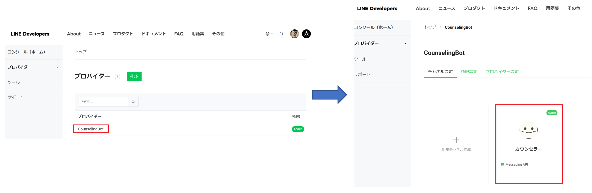
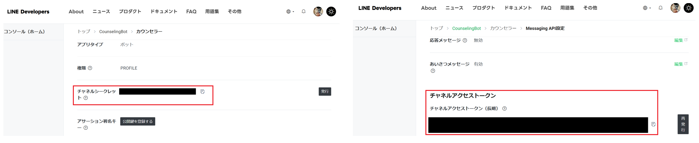
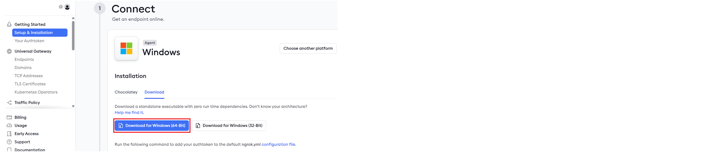
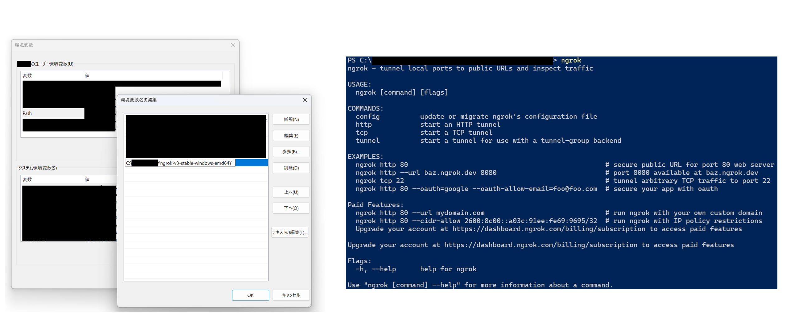
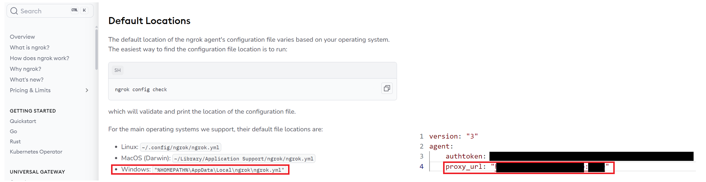
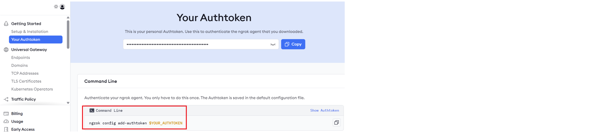

# Counseling Bot　ー環境構築ー


このREADMEでは，Windows環境におけるCounseling Botの開発用環境の準備手順について説明します．LINE Developersの設定およびngrokのインストール方法を中心に解説していきます．(最終更新：2025/05/28)

---


## Python環境
Python == 3.11.1
| ライブラリ  | バージョン |
| --------------------- | ---------- |
| Flask                 | 3.1.1      |
| line-bot-sdk          | 3.17.1     |
| stripe                | 12.2.0     |
| pyngrok               | 7.2.11     |
| waitress              | 3.0.2      |
| cheroot               | 10.0.1     |
| openai                | 1.90.0     |
| google-generativeai   | 0.6.15     |
| rapidfuzz             | 3.13.0     |
| watchdog              | 6.0.0      |

## LINE Developersの準備

1. **LINE Developersへのログインとプロバイダーの作成**  
   [LINE Developers](https://developers.line.biz/)にアクセスし，LINEアカウントでログインします．初めての方は「プロバイダー」を新規作成するか，既存のプロバイダーを選択してください．

2. **Messaging APIチャネルの作成**  
   ログイン後，**「チャネル作成」** ボタンをクリックし，「Messaging API」を選択します．必要な情報（チャネル名，メールアドレス，説明など）を入力し，チャネルを作成します．  
   

3. **チャネル情報の確認**  
   作成後，チャネルシークレットやアクセストークンが発行されます．アクセストークンはデフォルトでは発行されていないので，「発行」ボタンを押して生成してください．これらはBotの認証に必要となるため，大切に保管してください．
   

4. **Webhookの設定**  
   応答メッセージ機能を無効，Webhook機能を有効にし，LINEからのイベントを受け取れるよう設定します．ローカル環境で開発中は，後述のngrokで取得する公開URLをWebhook URLとして設定してください．
   


## ngrokのインストール
### Windows環境

ngrokは，ローカルサーバーを一時的に公開URLへ変換するツールです．以下の手順でセットアップしてください．

1. **アカウント作成とダウンロード**  
   [ngrokの公式サイト](https://ngrok.com/)にアクセスし，アカウントを作成します．[ダッシュボード](https://dashboard.ngrok.com/get-started/setup/windows)からWindows用のngrokバイナリをダウンロードしてください．
   

2. **展開と配置**  
   ダウンロードしたZIPファイルを解凍し，任意のディレクトリ（例: `C:\ngrok-v3-stable-windows-amd64\ngrok.exe`）に配置します．

3. **環境変数と実行確認**  
   環境変数の編集を行い，PATHを通します．その後，PATHが通ったことを確認するため，コマンドプロンプトを起動し，ngrokと打ち，正しく実行されるかを確認します．
   


4. **proxyの設定 <span style="color: red; "> ※大学proxyではアクセス拒否(403 Forbidden)を受け，実行不可能 </span>**  

   proxyの設定は，必要に応じて行ってください（[参考サイト](https://qiita.com/mizukyf/items/06b9a197a5c8f8fb42d)）  
   
   1. [ngrokドキュメント](https://ngrok.com/docs/agent/config/#default-locations)にアクセスし，検索ボックスで`Default Locations`で検索する．検索後，記載パスを辿り，ファイルがあることを確認する．
   
   2. ngrok.ymlファイルを開き，[フォーマット(v3)](https://ngrok.com/docs/agent/config/v3/)を参考に，proxyを設定する．
   

   


### Linux環境

  以下のコマンドを実行
```
curl -s https://ngrok-agent.s3.amazonaws.com/ngrok.asc | sudo tee /etc/apt/trusted.gpg.d/ngrok.asc >/dev/null && echo "deb https://ngrok-agent.s3.amazonaws.com buster main" | sudo tee /etc/apt/sources.list.d/ngrok.list && sudo apt update && sudo apt install ngrok
```


## ngrokの権限の有効化
   1. **ngrokの権限の有効化**  
   [ダッシュボード](https://dashboard.ngrok.com/get-started/your-authtoken)から，Authtokenをコピーし，コマンドラインから有効化します．
   
